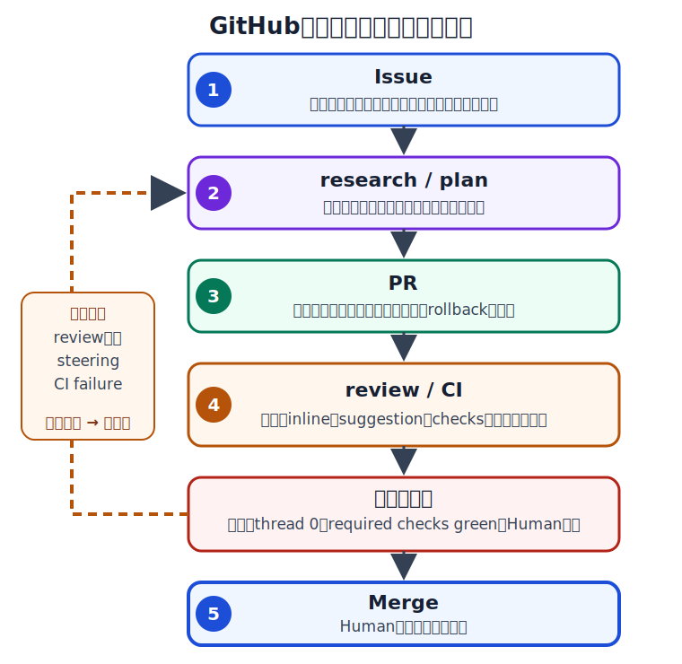

# 第6章：GitHub ネイティブな実行フロー

## この章で扱うこと

この章では、エージェント作業を GitHub 上の Issue、branch、PR、review、checks、session log に接続し、
人間が監査可能な単位で反復できる実行フローに落とし込みます。

扱う観点は次の通りです。

- Issue を「実行仕様」として整える
- research / plan / branch / PR / review / merge の各段階で残す証跡を決める
- Copilot cloud agent、Copilot code review、third-party agent、ローカル CLI をどう使い分けるか
- steering comment、review comment、CI failure を反復ループに接続する
- merge 後の main / Pages / deploy 確認までを完了条件に含める

## GitHub ネイティブ実行フローの全体像

GitHub ネイティブな AgentOps では、エージェントの作業を「チャットで完了した作業」ではなく、
GitHub 上の追跡可能な成果物に変換します。
標準フローは次の通りです。

1. **Issue**: 目的、スコープ、非スコープ、受入基準、制約、検証コマンドを固定する
2. **research / plan**: 影響範囲、既存設計、外部仕様、分割方針を調べ、必要なら Issue に追記する
3. **branch**: 1 つの意図に対応する branch を切る
4. **PR**: 変更意図、検証結果、残リスク、rollback を PR body に残す
5. **review**: 人間 review、Copilot code review、inline suggestion、CI 結果を突き合わせる
6. **iteration**: steering comment や review comment で最小修正し、再検証する
7. **merge**: 未解決 thread、required checks、承認条件、merge 後確認を満たしてから人間が責任を持つ
8. **post-merge**: main checks、Pages / deploy、Issue checklist、証跡コメントを確認する

<figure id="figure-issue-to-merge-iteration" class="concept-figure" tabindex="0">
  
  <figcaption>図6-1：Issueからresearch / plan、PR、review / CI、Mergeへ進む反復フロー</figcaption>
</figure>

重要なのは、各段階が GitHub の成果物として残ることです。
口頭や一時チャットだけで判断すると、後から「なぜその実装になったか」を説明できません。

## 実行経路の使い分け

GitHub 上のエージェント運用では、同じ Issue でも複数の実行経路を選べます。
次の表で、委譲範囲と人間の責任境界を分けます。

| 実行経路 | 向いている用途 | 主な証跡 | 人間が見る境界 |
| --- | --- | --- | --- |
| Copilot cloud agent | Issue から branch / PR まで任せる実装作業 | session log、commits、PR、checks | 受入基準、差分、CI 実行許可、merge 判断 |
| Copilot code review | 既存 PR のレビュー補助、suggestion 抽出 | review comments、suggested changes | 指摘の妥当性、採否理由、未解決 thread |
| third-party agent | 外部ツールや独自 agent を GitHub PR に接続する作業 | PR、bot comment、外部ログへの参照 | tool 権限、データ境界、監査可能性 |
| ローカル / CLI agent | maintainer が手元で調査、修正、検証する作業 | commit、PR body、ローカル検証ログ | 実行環境、network / sandbox / approval 設定 |

経路選定の基準は「どれが賢いか」ではなく、**どの証跡と責任境界を残せるか** です。
たとえば、広い調査や計画は cloud agent の session log と相性がよく、
最終の merge 判断や security 例外は人間 review と repository controls に戻します。
third-party coding agents は 2026-05-24 時点で public preview と明記されているため、
本書では便利な実行経路として扱い、基幹統制は Issue、PR、review、CI、rulesets 側に置きます。

## Issue を実行仕様にする

エージェントに渡す Issue は、依頼文ではなく実行仕様です。
最低限、次を揃えます。

| 項目 | 書く内容 | 不足した場合のリスク |
| --- | --- | --- |
| 目的 | 何を改善するか、なぜ今やるか | 実装方向がずれる |
| スコープ | 触ってよい章、機能、ファイル、外部仕様 | 差分が広がる |
| 非スコープ | 今回やらないこと | ついで修正が混ざる |
| 受入基準 | 完了を判断する具体条件 | review が主観化する |
| 検証 | 実行するコマンド、手動確認、公開確認 | green の意味が曖昧になる |
| 制約 | 互換性、権限、Secrets、費用、日付 | 危険操作や古い情報を前提にする |

曖昧な Issue は、エージェントに渡す前に質問として戻します。
ただし、すべてを事前に確定できない場合は、選択肢と判断材料を Issue コメントに残し、
決定後に作業へ進みます。

## research / plan を PR の前に固定する

商用運用では、いきなり差分を作るよりも、先に調査と計画を固定した方が手戻りを減らせます。
特に次の場合は、research / plan を独立した証跡として残します。

- 影響範囲が複数ディレクトリ、複数サービス、複数ドキュメントにまたがる
- 外部仕様、pricing、plan 条件、preview 状態など変化しやすい前提がある
- security、Secrets、workflow、deploy、MCP tool などの権限境界を触る
- 1PR で終わらないため、分割順序を決める必要がある

計画コメントの最小形は次です。

```text
[Plan]
目的: 第6章を GitHub ネイティブ実行フローに更新する
分割: 1) 第6章本文 2) 目次/付録参照 3) 生成 docs
検証: npm test / Jekyll build / 公開ページ marker smoke
非スコープ: 第8章のコスト詳細、第9章の継続的 AI 実装パターン比較
未確定: Copilot cloud agent の preview 対象クライアントは導入時に最新確認する
```

計画は実装前の拘束ではなく、レビュー時の判断材料です。
途中で変わった場合は、差分を steering comment として残します。

## PR を小さく保つ

AgentOps の PR は、通常の PR より速く大きくなりがちです。
次のいずれかに該当したら、分割を検討します。

- 変更意図が 2 つ以上ある
- review owner が異なる領域を同時に触る
- rollback 単位が分かれない
- CI 失敗時に原因を切り分けにくい
- PR body に「今回やらないこと」を書けない

分割は速度を落とすためではなく、review と rollback の単位を守るために行います。
「安全柵を先に置く PR」「本文を直す PR」「テンプレを追加する PR」のように、
依存順序が説明できる単位にします。

## review / steering / CI failure の反復ループ

エージェントへのフィードバックは、コメントの種類を分けると追跡しやすくなります。

| 入力 | 使う場面 | 記録すべきこと |
| --- | --- | --- |
| PR review | merge 前に品質、設計、セキュリティを確認する | 採否、修正 commit、不要理由 |
| inline comment / suggestion | 特定行に対する修正指示 | suggestion 適用有無、代替修正 |
| steering comment | 仕様や方針を途中で変える | 決定内容、理由、影響、非スコープ |
| CI failure comment | 失敗の原因と再実行理由を説明する | 失敗 run、再現性、修正、再実行結果 |

Copilot cloud agent に再作業を依頼する場合も、コメントは「作業指示」だけでなく監査ログです。
「直してください」ではなく、期待する変更、対象範囲、検証、非スコープを短く書きます。

```text
@copilot
第6章の review 指摘だけ対応してください。
対象: src/chapters/chapter06/index.md と生成 docs
非スコープ: 第8章以降の構成変更
検証: npm test と Jekyll build
完了時: どの指摘にどう対応したか PR コメントに要約してください
```

CI failure は、エージェントの失敗ではなく反復入力です。
失敗ジョブ、失敗コマンド、再現性、修正方針を PR に残し、成功した run へのリンクで閉じます。

## PR 完了ゲート

merge 前に、次のゲートを必ず確認します。

| ゲート | 証跡 | 完了条件 |
| --- | --- | --- |
| Issue linkage | 対応 Issue、受入基準、非スコープ | PR の意図が Issue から追える |
| Review completeness | review 本文、inline comments、suggestions、threads | 未回答 / unresolved が 0 件 |
| CI | required checks、失敗時の再実行理由 | head commit の checks が green |
| 権限 | workflow 変更、Secrets、MCP tool、外部 API | 第5章の prompt / forbidden に従っている |
| Merge | merge method、merge commit、rollback | 誰がどの根拠で merge したか分かる |
| Post-merge | main checks、deploy / Pages、Issue 更新 | 公開・本番状態まで確認済み |

Copilot cloud agent が作った PR では、ワークフロー実行が自動で走らない場合があります。
CI を実行する前に workflow 変更や Secrets 利用を確認し、承認してよい根拠を PR に残します。

## 公式情報の確認先

2026-05-24（Asia/Tokyo）時点で、本章の用語整理に使う主な一次情報は次です。
提供範囲、UI、preview 対象、plan 条件は変わり得るため、導入時は最新ページを確認してください。

- GitHub Docs: [About GitHub Copilot cloud agent](https://docs.github.com/en/copilot/concepts/agents/cloud-agent/about-cloud-agent)
- GitHub Docs: [Starting GitHub Copilot sessions](https://docs.github.com/en/copilot/how-tos/use-copilot-agents/cloud-agent/start-copilot-sessions)
- GitHub Docs: [Manage and track Copilot cloud agent sessions](https://docs.github.com/en/copilot/how-tos/use-copilot-agents/manage-agents)
- GitHub Docs: [Review output from Copilot](https://docs.github.com/en/copilot/how-tos/copilot-on-github/use-copilot-agents/review-copilot-output)
- GitHub Docs: [Using GitHub Copilot code review on GitHub](https://docs.github.com/en/copilot/how-tos/copilot-on-github/use-copilot-agents/copilot-code-review)
- GitHub Docs: [About third-party agents](https://docs.github.com/en/copilot/concepts/agents/about-third-party-agents)

## 章末チェックリスト

- [ ] Issue に目的、スコープ、非スコープ、受入基準、検証、制約がある
- [ ] research / plan / steering の決定が Issue または PR コメントとして残っている
- [ ] PR は 1 つの意図、1 つの rollback 単位で分割されている
- [ ] review 本文、inline comment、suggestion、unresolved thread を merge 前に確認している
- [ ] CI failure の原因、修正、再実行結果を PR に残している
- [ ] merge 後に main checks、deploy / Pages、Issue checklist を確認している

## まとめ

GitHub ネイティブな実行フローの要点は、エージェント作業を GitHub 上の証跡へ変換することです。
Issue、plan、branch、PR、review、checks、session log、post-merge 確認を連結すると、
AI エージェントに作業速度を委譲しながら、人間が説明責任と最終判断を保持できます。
